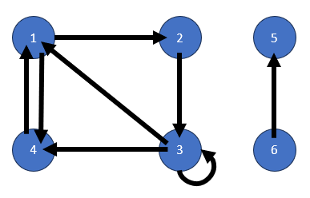

<h1 align="center" style="text-decoration: underline; font-weight: bold;"> Introdução a Grafos </h1>

# Terminologia:
1. `Grafo:` Conjunto de vértices e arestas.
2. `Vértice:` Um nó que guarda informações. Pode ser utilizado para representar uma cidade, uma pessoa, uma máquina...
3. `Aresta:` Uma ligação entre dois vértices. Podem indicar também a distância entre os dois vértices, direção...
4. `Grafo Direcionado:` Grafo em que as arestas possuem direção. Uma aresta que sai do vértice A e chega no vértice B, não é a mesma coisa que uma aresta que sai do vértice B e chega no vértice A.
5. `Grafo Não Direcionado:` Grafo em que as arestas não possuem direção. As arestas são representadas como um par ordenado, onde a ordem não importa.
6. `Passeio:` Sequência de vértices. Ex: A -> B -> C -> B -> C
7. `Caminho:` Passeio em que não há repetição de vértices. Ex: A -> B -> C
8. `Comprimento de um Passeio:` Número de arestas do passeio.
9. `Grau:` Número de arestas que incidem em um vértice. No caso de grafos direcionados, o grau é dividido em grau de entrada e grau de saída.
10. `Ordem:` Número de vértices do grafo.
11. `Vértice Adjacente:` Vértice que possui uma aresta que o liga a outro vértice. Caso exista uma aresta A - B, A e B são adjacentes.
12. `Sucessor:` Vértice que possui uma aresta que sai dele e chega em outro vértice. Caso exista uma aresta A -> B, B é sucessor de A.
13. `Predecessor:` Vértice que possui uma aresta que sai de outro vértice e chega nele. Caso exista uma aresta A -> B, A é predecessor de B.
14. `Ciclo:` Passeio que começa e termina no mesmo vértice.
15. `Árvore:` Grafo sem ciclos.
16. `Folha:` Vértice que possui grau 1. Ou seja, possui apenas uma aresta.
17. `Sub-Grafo:` Grafo que possui um subconjunto de vértices e arestas de um grafo maior.
18. `Completo:` Grafo em que todos os vértices são adjacentes entre si. Ou seja, todos os vértices possuem arestas que os ligam a todos os outros vértices.

# Matriz de Adjacência:
&emsp;&emsp; Essa é a primeira representação que vamos ver. Ela é uma matriz quadrada de ordem n, sendo n o número de vértices, onde cada posição representa uma aresta do grafo.

&emsp;&emsp; Caso exista uma aresta que sai do vértice i e chega no vértice j, a posição linha i coluna j da matriz recebe o valor 1. Caso contrário, recebe o valor 0.

&emsp;&emsp; Apropriada para grafos mais densos (com muitas arestas) e para casos em que é necessário verificar se existe uma aresta entre dois vértices rapidamente.

## `| Exemplo:`

|   |`1`|`2`|`3`|`4`|`5`|`6`|
|---|---|---|---|---|---|---|
|`1`| 0 | 1 | 0 | 1 | 0 | 0 |
|`2`| 0 | 0 | 1 | 0 | 0 | 0 |
|`3`| 1 | 0 | 1 | 1 | 0 | 0 |
|`4`| 1 | 0 | 0 | 0 | 0 | 0 |
|`5`| 0 | 0 | 0 | 0 | 0 | 0 |
|`6`| 0 | 0 | 0 | 0 | 1 | 0 |

Dos 36 espaços da matriz, apenas 8 são preenchidos. Ou seja, apenas 22% da matriz é utilizada nesse caso.

## `| Vantagens:`
1. Acesso rápido a existência de uma aresta entre dois vértices.
2. Adição e remoção de arestas é simples.
3. Fácil evitar a existência de arestas paralelas.
4. Arranjo bidimensional de booleanos.

## `| Desvantagens:`
1. Ocupa uma quantidade de memória proporcional a n². Não é apropriada para grafos esparsos (com poucas arestas).
2. A simples inicialização da matriz pode ser dominante na execução global do algoritmo.
3. Pode sequer ser possível inicializar a matriz se o número de vértices for muito grande.

## `Lista de Adjacência:`
&emsp;&emsp; Essa representação é basicamente uma versão compacta da matriz de adjacência. Cada vértice é uma lista encadeada que guarda os vértices adjacentes a ele, ou seja, temos uma matriz esparsa (tema abordado na semana 10).

&emsp;&emsp; Apropriada para grafos mais esparsos (com poucas arestas) e para casos em que é necessário percorrer todos os vértices adjacentes a um vértice rapidamente.

# Matriz de Incidência:
&emsp;&emsp; Uma matriz de ordem n x m, sendo n o número de vértices e m o número de arestas, onde cada posição representa se uma aresta está ligada a um vértice.

&emsp;&emsp; Caso exista uma aresta que sai do vértice i e chega no vértice j, a linha i coluna ij da matriz recebe o valor 1. Caso exista uma aresta que sai de j e chega em i, a linha i coluna ij recebe o valor -1. Caso contrário, recebe o valor 0. Caso seja um grafo não direcionado, a matriz possui apenas valores 0 e 1.

## `| Exemplo:`

|   |`1,2`|`1,3`|`1,4`|`2,3`|`3,3`|`3,4`|`5,6`|
|---|-----|-----|-----|-----|-----|-----|-----|
|`1`|  1  | -1  |  1  |  0  |  0  |  0  |  0  |
|`2`| -1  |  0  |  0  |  1  |  0  |  0  |  0  |
|`3`|  0  |  1  |  0  | -1  |  1  |  1  |  0  |
|`4`|  0  |  0  |  1  |  0  |  0  | -1  |  0  |
|`5`|  0  |  0  |  0  |  0  |  0  |  0  | -1  |
|`6`|  0  |  0  |  0  |  0  |  1  |  0  |  1  |
